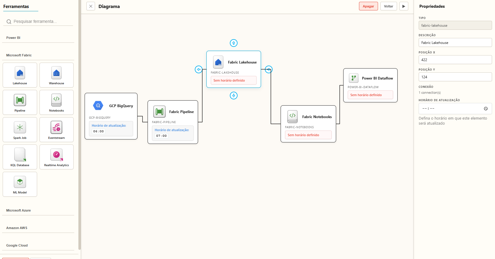

# PowerDraw Studio

Uma ferramenta visual criada para quem vive Dados, BI e Cloud.

O objetivo é simples.
Tornar o processo de diagramar moderno, fluido e intuitivo, oferecendo uma experiência visual que ajuda tanto na apresentação quanto no entendimento.

## Visão Geral

O PowerDraw Studio permite criar diagramas modernos e profissionais para representar pipelines, fluxos e arquiteturas de dados.
A ferramenta combina estética, fluidez e clareza para transformar processos complexos em algo simples e compreensível.

Ideal para documentação técnica, apresentações estratégicas e comunicação entre times.

## Interface

## Principais Recursos

- Blocos com ícones oficiais de Power BI, Fabric, Azure, AWS e GCP
- Conexões inteligentes com curvas suaves
- Interface clara, minimalista e responsiva
- Drag and drop fluido
- Exibição opcional do horário de atualização
- Ideal para documentar pipelines e arquiteturas
- Excelente para apresentações de negócio
- Visual profissional e elegante

## Como funciona

### Blocos Inteligentes
Representados pela classe `DiagramElement`, que gerencia:
- renderização
- seleção
- movimentação
- ícone e tipo
- propriedades personalizadas

### Conexões via SVG
As conexões usam SVG com curvas que se ajustam conforme os blocos são movidos.

### Movimentação Suave
Eventos de mouse garantem fluidez e precisão.

### Propriedades Dinâmicas
Cada bloco pode exibir:
- nome
- ícone
- tipo
- horário de atualização
- nível de complexidade

## Tecnologias Utilizadas

- HTML
- CSS
- JavaScript
- Arquitetura extensível
- Sistema local de histórico

## 🔍 Testar o projeto

Você pode testar a versão online do PowerDraw Studio diretamente pelo link:

https://power-draw-studio.vercel.app/

---

## Contribuindo 
Sugestões e melhorias são bem-vindas. Abra uma issue ou pull request. 

## Fale comigo 

Sua opinião pode virar a próxima feature.